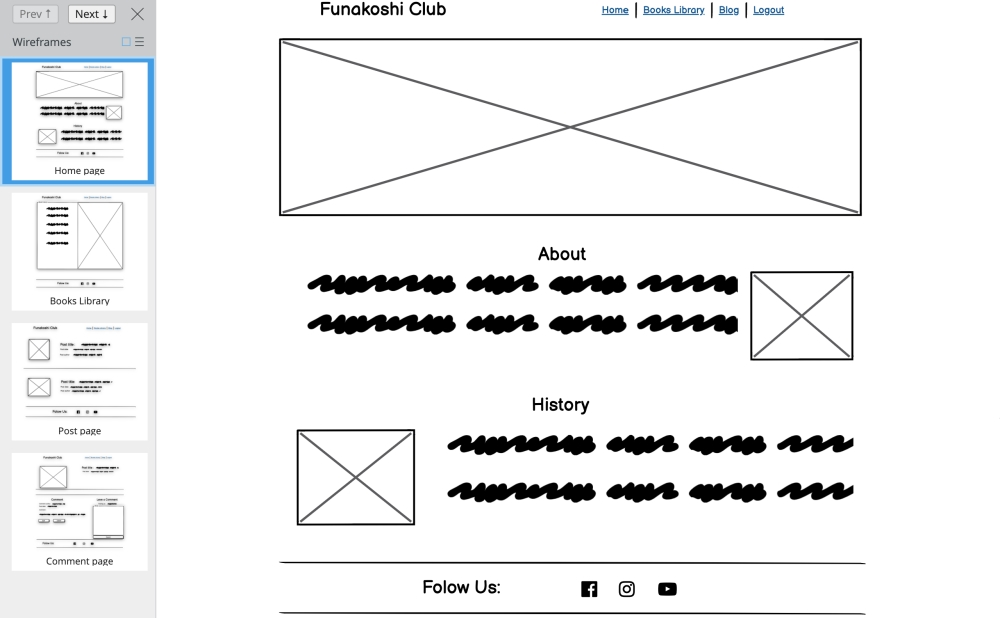

# Funakoshi club

# About
Funakoshi Club is a very friendly website for all people who practise Shotokan Karate or those who want to take an interest in it. This website has a few different functions, you can read a bit about the history of Shotokan Karate on the home page, you can find links to suggested books from different websites on the Books Library page. We also have a blog to share your thoughts, experiences and view other people's, ability to book your place at the seminars. to use the blog you have to create an account. Ability to book your place at the seminars.

[Live Website](https://funakoshiclub.herokuapp.com/)

## Table of Contents
  - [User goals](#User-goals)
  - [Features](#features)
  - [Technologies Used](#technologies-used)
  - [Framewoks](#frameworks)
  - [Testing](#testing)
  - [Deployment](#deployment)
  - [Acknowledgement](#acknowledgement)

## User Stores
  - As a Site Admin I can create, create, update and delete post so that I can manage my blog content.
  - As a Site Admin I can create draft posts so that I can finish writing the content later.
  - As a Site Admin I can approve and disapprove comments so that I can filter out objectionable comments.
  - As a Site User I can view a paginated list of topics so that I can easily choose the topic what I am    interesting in.
  - As a site User I can leave comments on a post so that I can be involved in the conversation.
  - As a Site User I can register an account so that I can comment and like.
  - As a Site User I can view a list of posts so that I can select one to read.
  - As a Site User I can read a history article so that I can get more info about this sport.
  - As a Site User I can like or unlike post so that I can interact with the comment.
  - As a Site User / Admin I can view the numbers of likes on each post so that I can see which is the most viral.
  - As a Site User / Admin I can view comments on an individual post so that I can read the conversation.
  - As a Site User I can understand what is this site about so that I can see if this is what I am looking for.
  - As a Site User I can find a list of related books so that I can find them and read more info about martial technic and history.
  - As a Site User I can edit and delete my comments so that I can manage my comments by editing or deleting it.

## Features

### Existing Features
 ### Home
  The home page split into 2 parts from the header and footer
  - ### About
  

  This section describes what is about this website and how to use it.

  - ### History
  

  This section tells us a little bit of the history of this sport, by who and when was created.

 ### Book library
 

 On this page, we can find recommended karate books and website's links from where we can buy them.

 ### Blog
 

 On this page is all posts created with the date, time.

 ### Post Detailes
 

 On this page is the post details created by Admin, all the comments left by different users and a section to leave your comment.

## Technologies Used

__Balsmiq Wireframe__

 The Wireframe of this website was built in [Balsamic](https://balsamiq.cloud/)

  

 ### Libraries

  - For the account registration used [Django-allauth](https://django-allauth.readthedocs.io/en/latest/) library
  - For the feature images and CSS support used the [Cloudinary library](https://cloudinary.com/)
  - For the comments used [Crispy forms](https://django-crispy-forms.readthedocs.io/en/latest/) library
  - For the login/logout templates used default account templates from [Allauth](https://django-allauth.readthedocs.io/en/latest/) library
  - For Awesome icons used [Font Awesome](https://fontawesome.com/)

 ### Programming languages

- [HTML](https://www.w3schools.com/html/default.asp)
- [CSS](https://www.w3schools.com/css/default.asp)
- [Java Script](https://www.w3schools.com/js/default.asp)
- [Python](https://www.w3schools.com/python/default.asp)

 ### Framewoks
   - [Django](https://www.djangoproject.com/) - Django is a high-level Python Web framework that encourages rapid development and clean design.
   - [Boostrap](https://getbootstrap.com/) - Bootstrap is a web framework that focused on simplifying the development of an informative web page.

### Database
Used [SQL](https://www.w3schools.com/sql/default.asp) database by default.

- Library app

| Name | Key | Type | Extra Info |
| :--------------: | :----------------: | :--------------: | :----------------: |
| Name | name | CharField | max_length=254 |
| Writer | writer | CharField | max_length=254 |
| Description | description | TextField |  |
| Link | link | CharField | max_length=600 |

- Blog App (Post)

| Name | Key | Type | Extra Info |
| :--------------: | :----------------: | :--------------: | :----------------: |
| Title | title | CharField | max_length=200, unique=True |
| Slug | slug | SlugField | max_length=200, unique=True |
| Author | author | ForeignKey | User, on_delete=models.CASCADE, related_name="blog_post" |
| Updated On | updated_on | DateTimeField | auto_now=True |
| Content | content | TextField |  |
| Featured Image | featured_image | CloudinaryField | 'image', default='placeholder' |
| Excerpt | excerpt | TextField | blank=True |
| Created On | created_on | DateTimeField | auto_now_add=True |
| Status | status | IntegerField | choices=STATUS, default=0 |
| Likes | likes | ManyToManyField | User, related_name='blog_likes', blank=True |

- Blog App (Comment)

| Name | Key | Type | Extra Info |
| :--------------: | :----------------: | :--------------: | :----------------: |
| Post | post | ForeignKey | Post, on_delete=models.CASCADE, related_name='comments' |
| Name | name | CharField | max_length=80 |
| Email |  email | EmailField |  |
| Body | body  | TextField |  |
| Created On | created_on | DateTimeField | auto_now_add=True |
| Approved | approved | BooleanField | default=True |
| Likes | likes  | ManyToManyField | User, related_name='comment_likes', blank=True |

## Testing

 ### Validator Testing

## Deployment

  - ### Create the Heroku app
    On the Heroku, dashboard click on the "Create new app" button then give the app a name, choose a region and click on the "Create app" button.

  - ### Attach the PostgreSQL database
    On the Heroku, menu clicks on the "Resources" tab then in "Add-ons" search for "Postgres" to add Heroku Postgres to the project.

  - ### Prepare our environment and [settings.py](https://github.com/SerjMartin/Funakoshi-Club/blob/main/funakoshi/settings.py) files
    In the project's [settings.py](https://github.com/SerjMartin/Funakoshi-Club/blob/main/funakoshi/settings.py) add the app name in "INSTALET_APP".
    Create the [env.py](https://github.com/SerjMartin/Funakoshi-Club/blob/main/env_sample.py) file to store the URL from DATABASE, CLAUDINARY and SECRET_KEY then add them in the Heroku "Config Vars".

  - ### Get our static and media files stored on Cloudinary
    In the project's [settings.py](https://github.com/SerjMartin/Funakoshi-Club/blob/main/funakoshi/settings.py) by adding followings lines (STATICFILES_STORAGE = 'cloudinary_storage.storage.StaticHashedCloudinaryStorage'
    STATICFILES_DIRS = [os.path.join(BASE_DIR, 'static')]
    STATIC_ROOT = os.path.join(BASE_DIR, 'staticfiles')

    MEDIA_URL = '/media/'
    DEFAULT_FILE_STORAGE = 'cloudinary_storage.storage.MediaCloudinaryStorage') we telling Django to store my static and media files in Cloudinare.

 - ### Deployment to Heroku
    Add Heroku's app name followed by herokuapp.com to ALLOWED_HOST from [setings.py](https://github.com/SerjMartin/Funakoshi-Club/blob/main/funakoshi/settings.py).
    Add a file named "Procfile" for Heroku to know how to run my project.
    In the Heroku, dashboard click on the "Deploy" tab then click on GitHub to connect GitHub account after that searching for a repo to connect it to the Heroku.

### Cloning

If you wish to clone this repository you can follow the following steps below.
   - Go to the Git Hub website and log in.
   - Locate the [Repository](https://github.com/SerjMartin/Funakoshi-Club) used for this project.
   - Under the Repository's name locate the "Code" button.
   - Either Download the ZIP file, unpackage locally and open with IDE (This route ends here) OR Copy Git URL    from the HTTPS dialogue box.
   - Open your developement editor of choice and open a terminal window in a directory of your choice.
   - Use the git clone command in terminal followed by the copied git URL.
   - A clone of the project will be created locally on your machine.
Once the project has been loaded into an IDE of choice, run the following command in the shell to install all the required packages: pip install -r requirements.txt.

## Acknowledgement

  - Thank you to everyone who took their time to provide me with constructive feedback on the Slack community app.
  - Big thanks to my mentor 'Tim Nelson' for his time to answer all my questions and his professional advice.

